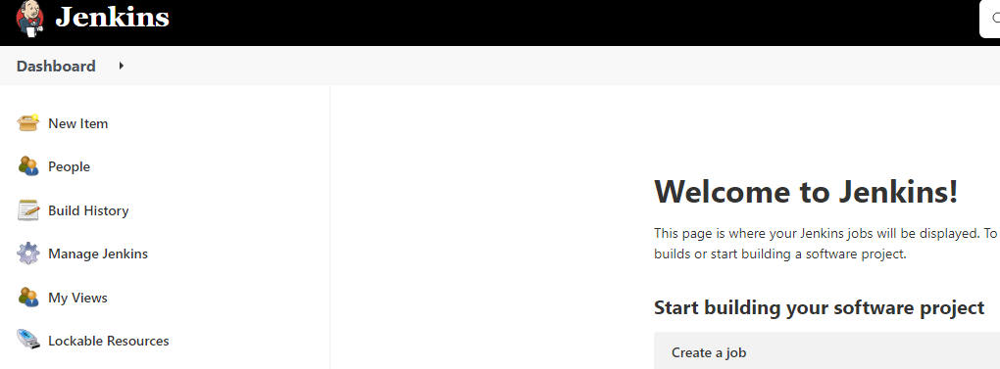
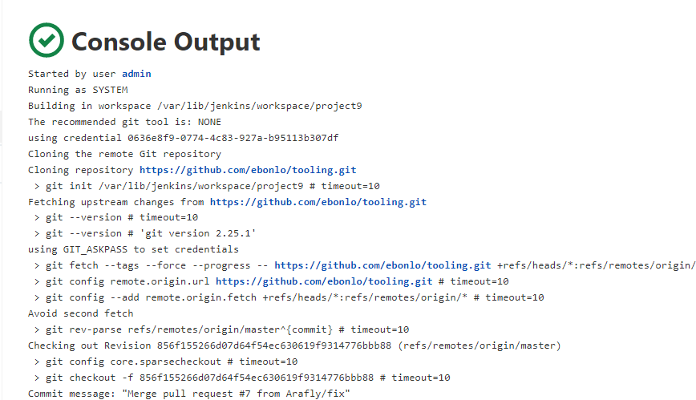
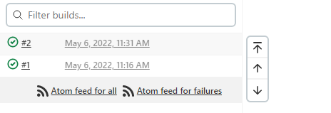
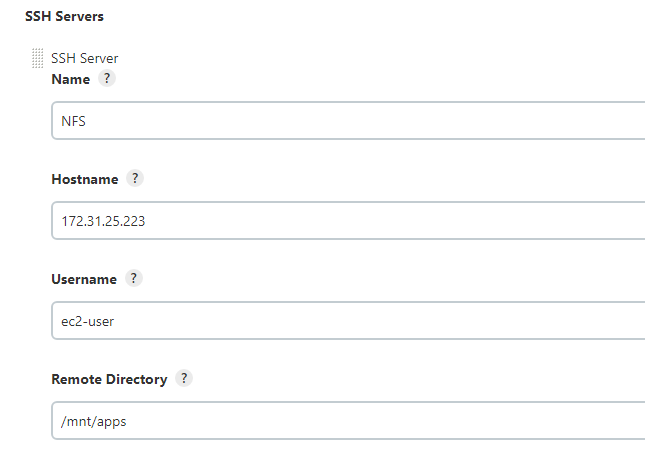
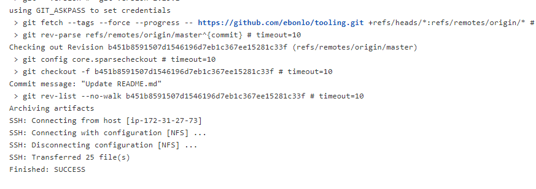

# TOOLING WEBSITE DEPLOYMENT AUTOMATION WITH CONTINUOUS INTEGRATION
## INSTALL AND CONFIGURE JENKINS SERVER
> Create an AWS EC2 server based on Ubuntu Server 20.04 LTS.
> Connect to it and Install JDK (since Jenkins is a Java-based application).
```
sudo apt update
sudo apt install default-jdk-headless
wget -q -O - https://pkg.jenkins.io/debian-stable/jenkins.io.key | sudo apt-key add -
sudo sh -c 'echo deb https://pkg.jenkins.io/debian-stable binary/ > \
    /etc/apt/sources.list.d/jenkins.list'
sudo apt update
sudo apt-get install jenkins
sudo systemctl status jenkins
```
From your browser access http://Jenkins-Server-Public-IP-Address-or-Public-DNS-Name:8080



## Configure Jenkins to retrieve source codes from GitHub using Webhooks
> Enable webhooks in your GitHub repository settings
> Go to Jenkins web console, click "New Item" and create a "Freestyle project"
> Connect to your GitHub repositoryby providing its URL to your Jinkins web console.
> In configuration of your Jenkins freestyle project choose Git repository, provide there the link to your Tooling GitHub repository and credentials (user/password) so Jenkins could access files in the repository
> Run a build manually by clicking on Buildnow. You should get the following result.

> Configure triggering the job from GitHub webhook
> Now, go ahead and make some change in any file in your GitHub repository (e.g. README.MD file) and push the changes to the master branch. You should see a second build


## CONFIGURE JENKINS TO COPY FILES TO NFS SERVER VIA SSH
> Now we have our artifacts saved locally on Jenkins server, the next step is to copy them to our NFS server to /mnt/apps directory. To do this, we have to install the 'Publish Over SSH' plugin.


> open your Jenkins job/project configuration page and add another one "Post-build Action", Send build artifacts over SSH.
> Save this configuration and go ahead, change something in README.MD file in your GitHub Tooling repository.
>Webhook will trigger a new job and in the "Console Output" of the job you should see the following result:



